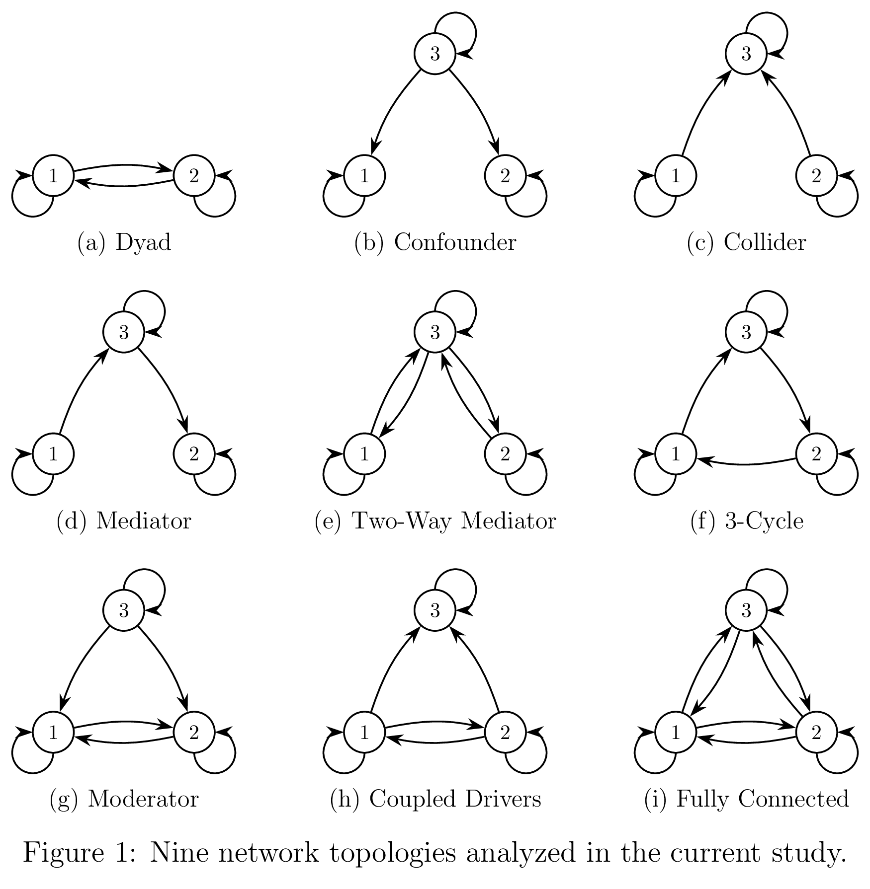

# How does correlation relate to causation: seven insights from an analytic relationship between the two

**Author:** Yaohui Ding, Ph.D.

## Project Overview

This paper derives closed-form analytic expressions for pairwise correlation
coefficients as explicit functions of causal parameters and noise variances,
for linear stochastic dynamical systems at steady state. The central
mathematical object is the Lyapunov equation, solved via the half-vectorization
technique and symbolic matrix inversion. The Lyapunov equation is solved for
nine network topologies (one dyadic, eight triadic) to illustrate the analytic
relationship between correlation and causation for this widely used class of
dynamical system.





## Repo Structure

```
corr_causation/
├── README.md
├── corr_causation.tex
├── corr_causation.bib
├── nomenclature.md
├── appendices/
│   ├── appendix_a_lyapunov_derivation.tex
│   ├── appendix_b_nxn_network_solution.tex
│   ├── appendix_c_dyadic_interaction.tex
│   ├── appendix_d_triadic_interaction.tex
│   ├── appendix_d_figs_layout_parameters.md
│   ├── appendix_e_table_prior_studies.tex
│   └── appendix_{a,b,c,d,e}.bib
├── figures/
│   ├── fig1_topologies.png
│   └── topo_<slug>_figures/
│       └── B1.pdf, B2.pdf, B3.pdf, C1.pdf, C2.pdf, C3.pdf, colorbar.pdf
├── scripts/
│   ├── plot_figure1/
│   ├── solve_networks/
│   └── plot_networks/
└── build/
```

**Notes:**
- `nomenclature.md` — notation/symbol registry.
- `appendices/*.bib` — one per appendix, for standalone compilation.
- `figures/` — `fig1_topologies.png` is Figure 1; one `topo_<slug>_figures/` subfolder per topology (nine total).
- `scripts/plot_figure1/` — TikZ source for Figure 1.
- `scripts/solve_networks/` — MATLAB, derives closed-form formulae.
- `scripts/plot_networks/` — MATLAB, renders the panels in `figures/`.
- `build/` — compiled output, regenerated on compile.

## Reproducibility

### Reproducing the formulae in the manuscript

Requires **MATLAB** (developed on R2025a) with the **Symbolic Math Toolbox**
(version 25.1, bundled with R2025a). From `scripts/solve_networks/`, run any
solver, e.g.:

```matlab
solve_topo_3node_full
```

Each script defines the topology's `A` matrix (diagonal entries kept distinct),
checks its permutation symmetry via `network_symmetry`, then calls the shared
engine `lyap_halfvec` to get the determinant `|K|`, covariance entries, and
headline correlation. `lyap_halfvec(A, Sigma_W)` is dual-mode: symbolic input
returns the closed-form solution; numeric input defers to MATLAB's built-in
`lyap` and also returns the correlation matrix.

### Reproducing the figures in the manuscript

Requires **MATLAB** (developed on R2025a; no Symbolic Math Toolbox needed).
From `scripts/plot_networks/`, run any subplot script, e.g.:

```matlab
plot_topo_2node_dyad_subplot
```

Each script sweeps a topology's off-diagonal causal parameters over a grid,
evaluates the closed-form correlation formula from `scripts/solve_networks/`
at each point, and exports one contour/vector-field panel per parameter
combination as a standalone PDF (plus a shared colorbar), matching the layout
LaTeX assembles into the manuscript's figures.

### Building the manuscript

Requires a TeX distribution (e.g. TeX Live). From the project root:

```bash
mkdir -p build/corr_causation
pdflatex -output-directory=build/corr_causation corr_causation.tex
BIBINPUTS=. bibtex build/corr_causation/corr_causation
cd build/corr_causation
BIBINPUTS=.:../../:../../appendices: bibtex bu1
BIBINPUTS=.:../../:../../appendices: bibtex bu2
BIBINPUTS=.:../../:../../appendices: bibtex bu3
BIBINPUTS=.:../../:../../appendices: bibtex bu4
BIBINPUTS=.:../../:../../appendices: bibtex bu5
cd ../..
pdflatex -output-directory=build/corr_causation corr_causation.tex
pdflatex -output-directory=build/corr_causation corr_causation.tex
```

The `mkdir -p` is required first — `pdflatex` does not create its output directory itself
and fails immediately if it doesn't already exist. The `BIBINPUTS=.` is needed because the
build output directory differs from the `.bib` location. The `bu1`–`bu5` passes are required
too: each appendix (A–E) is typeset as its own independent bibliography via the `bibunits`
package, so the main `bibtex` pass alone leaves every appendix citation undefined — skipping
this step is the most common way to get a PDF full of "`[?]`" citation markers.

Each appendix also compiles standalone. From `appendices/`:

```bash
mkdir -p ../build/appendices/appendix_a_lyapunov_derivation
pdflatex -output-directory=../build/appendices/appendix_a_lyapunov_derivation appendix_a_lyapunov_derivation.tex
```

Appendices B, C, and D each cross-reference the one before it (B→A, C→B, D→C), so compile
in order (A → B → C → D) the first time, so each one's `.aux` file exists when the next
needs it.

## Citation

Ding, Y. (2026). *How does correlation relate to causation: seven insights from
an analytic relationship between the two.* Preprints.org.
https://doi.org/10.20944/preprints202608.1393.v1

```bibtex
@article{Ding2026CorrCausation,
  author  = {Ding, Yaohui},
  title   = {How does correlation relate to causation: seven insights from an analytic relationship between the two},
  year    = {2026},
  journal = {Preprints.org},
  doi     = {10.20944/preprints202608.1393.v1}
}
```

## License

MIT License — see [LICENSE](LICENSE).
